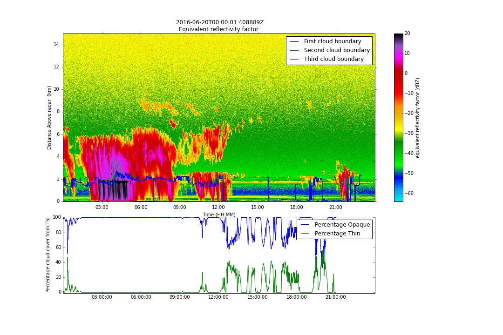

============================================
Design for Clutter Analysis for the OLI KaZR
============================================

Introduction and Aims
=====================
The Ka-Band Zenith Pointing Radar (KaZR) was deployed as part of an ARM Mobile
Facility three (AMF3) deployment to Oliktok Point on the North Slope of Alaska.
Figure 1 shows a time height plot of reflectivity factor from the KaZR with a
number of indicator of clouds co-plotted.

   
   Figure 1: Time height plot of reflectivity with cloud base heights from the 
   Ceilometer overlaid in the top panel. The Total Sky imager derived cloud 
   cover for thick and opaque clouds is in the lower panel. Note the constant 
   signals around 1km due to clutter. 
   
Clutter can be seen as a constant signal at around 1,500 meters above the radar. 
The aim of this task is to produce a map of affected gates and to study the
temporal variability and impact on overlaid meteorological signals. There will
be two deliverables: A CF-Radial file describing the clutter field and a Jupyter
notebook showing the analysis of the clutter field. 

Methodology
===========
Analysis will be performed using the Python programming language and will make
extensive use of Py-ART. We will use the Sky Cover VAP from the total sky imager
and the cloud base heights from the ceilometer to identify clear air days. We
will then look at the average returned power to identify affected gates. We will
look within our data set to see if there is any discernible diurnal or other
cycle in the clutter data and also look at the variability to see if there were
any external events that changed the power returns. 

In addition we will identify several cases where there is a meteorological
signal in a clutter impacted gate and look at the radar Doppler spectrum to see
just how severely impacted weather returns are and if we may be able subtract
the clutter signal from meteorological return and recalculate the moments.

Effort, Staff and Impact
========================
This task will be carried out by Scott Collis at Argonne National Laboratory. We
expect it to take 60 hours of effort and be delivered by October 1st 2016. There
is no impact on operations, however the work will delay other products work
being carried out by Translator team at Argonne. 

Example DoD
===========
.. code-block:: guess

    netcdf test_mean {
    dimensions:
        time = UNLIMITED ; // (1 currently)
        range = 607 ;
        sweep = 1 ;
        string_length = 32 ;
        frequency = 1 ;
    variables:
        double time(time) ;
            string time:long_name = "Time offset from midnight" ;
            string time:units = "seconds since 2016-06-20 00:00:00 0:00" ;
            string time:comment = "times are relative to the volume start time" ;
            string time:standard_name = "time" ;
            string time:calendar = "gregorian" ;
        float range(range) ;
            string range:long_name = "Range to measurement volume" ;
            string range:units = "m" ;
            range:meters_to_center_of_first_gate = 57.29303f ;
            string range:spacing_is_constant = "true" ;
            string range:standard_name = "projection_range_coordinate" ;
            range:meters_between_gates = 29.97925f ;
            string range:axis = "radial_range_coordinate" ;
        float azimuth(time) ;
            string azimuth:long_name = "Azimuth angle from true north" ;
            string azimuth:units = "degree" ;
            string azimuth:standard_name = "ray_azimuth_angle" ;
            string azimuth:axis = "radial_azimuth_coordinate" ;
        float elevation(time) ;
            string elevation:long_name = "Elevation angle from horizontal plane" ;
            string elevation:units = "degree" ;
            string elevation:standard_name = "ray_elevation_angle" ;
            string elevation:axis = "radial_elevation_coordinate" ;
        float daily_mean_snr(time, range) ;
            daily_mean_snr:long_name = "Mean SNR across sunny periods" ;
            daily_mean_snr:units = "dB" ;
            daily_mean_snr:_FillValue = -9999.f ;
            daily_mean_snr:standard_name = "signal_to_noise_ratio" ;
            daily_mean_snr:valid_min = -100L ;
            daily_mean_snr:valid_max = 100L ;
        int sweep_number(sweep) ;
            string sweep_number:long_name = "Sweep number, zero-based count" ;
            string sweep_number:units = "count" ;
        float fixed_angle(sweep) ;
            string fixed_angle:long_name = "Target angle for sweep" ;
            string fixed_angle:units = "degree" ;
        int sweep_start_ray_index(sweep) ;
            string sweep_start_ray_index:long_name = "Time index of first ray in sweep, 0-based" ;
            string sweep_start_ray_index:units = "count" ;
        int sweep_end_ray_index(sweep) ;
            string sweep_end_ray_index:long_name = "Time index of last ray in sweep, 0-based" ;
            string sweep_end_ray_index:units = "count" ;
        char sweep_mode(sweep, string_length) ;
            string sweep_mode:long_name = "Scan mode for sweep" ;
            string sweep_mode:units = "unitless" ;
            string sweep_mode:comment = "possible values: possible values: sector, coplane, 
                rhi, vertical_pointing, idle, azimuth_surveillance, elevation_surveillance, sunscan, 
                pointing, manual_ppi, manual_rhi" ;
        float radar_beam_width_h ;
            string radar_beam_width_h:long_name = "Half-power radar beam width, horizontal channel" ;
            string radar_beam_width_h:units = "degree" ;
            string radar_beam_width_h:meta_group = "radar_parameters" ;
        int n_samples(time) ;
            string n_samples:long_name = "Number of samples used to compute moments" ;
            string n_samples:units = "unitless" ;
            string n_samples:meta_group = "instrument_parameters" ;
        float unambiguous_range(time) ;
            string unambiguous_range:long_name = "Unambiguous range" ;
            string unambiguous_range:units = "m" ;
            string unambiguous_range:meta_group = "instrument_parameters" ;
        float prt(time) ;
            string prt:long_name = "Pulse repetition time" ;
            string prt:units = "s" ;
            string prt:standard_name = "pulse_repetition_time" ;
            string prt:meta_group = "instrument_parameters" ;
        float frequency(frequency) ;
            string frequency:long_name = "Operating frequency" ;
            string frequency:units = "Hz" ;
            string frequency:meta_group = "instrument_parameters" ;
        float nyquist_velocity(time) ;
            string nyquist_velocity:long_name = "Unambiguous Doppler velocity" ;
            string nyquist_velocity:units = "m/s" ;
            string nyquist_velocity:meta_group = "instrument_parameters" ;
        float pulse_width(time) ;
            string pulse_width:long_name = "Pulse width" ;
            string pulse_width:units = "s" ;
            string pulse_width:meta_group = "instrument_parameters" ;
        float radar_beam_width_v ;
            string radar_beam_width_v:long_name = "Half-power radar beam width, vertical channel" ;
            string radar_beam_width_v:units = "degree" ;
            string radar_beam_width_v:meta_group = "radar_parameters" ;
        double latitude ;
            string latitude:long_name = "Latitude" ;
            string latitude:units = "degree_N" ;
            string latitude:standard_name = "latitude" ;
        double longitude ;
            string longitude:long_name = "Longitude" ;
            string longitude:units = "degree_E" ;
            string longitude:standard_name = "longitude" ;
        double altitude ;
            string altitude:long_name = "Altitude" ;
            string altitude:units = "m" ;
            string altitude:standard_name = "altitude" ;
        double altitude_agl ;
            string altitude_agl:long_name = "Height of radar antenna above ground level" ;
            string altitude_agl:units = "m" ;
            string altitude_agl:standard_name = "height" ;
        char time_coverage_start(string_length) ;
            time_coverage_start:long_name = "UTC time of first ray in the file" ;
            time_coverage_start:units = "unitless" ;
        char time_coverage_end(string_length) ;
            time_coverage_end:long_name = "UTC time of last ray in the file" ;
            time_coverage_end:units = "unitless" ;
        char time_reference(string_length) ;
            time_reference:long_name = "UTC time reference" ;
            time_reference:units = "unitless" ;
        int volume_number ;
            volume_number:long_name = "Volume number" ;
            volume_number:units = "unitless" ;
        char platform_type(string_length) ;
            platform_type:long_name = "Platform type" ;
        char instrument_type(string_length) ;
            instrument_type:long_name = "Instrument type" ;
        char primary_axis(string_length) ;
            primary_axis:long_name = "Primary axis" ;

    // global attributes:
            :data_level = "f1" ;
            string :attenuation_applied = "4.00 dB  " ;
            string :site_id = "oli" ;
            string :antenna_altitude = "3.81 m" ;
            string :facility_id = "M1" ;
            string :institution = "Department of Energy Atmospheric 
                    Radiation Measurement Program" ;
            :process_version = "0.1-daily-clutter" ;
            :datastream = "olikazrclutter.f1" ;
            :title = "KaZR2 clutter analysis" ;
            string :operating_mode_description = "General mode, less sensitive but full 
                    range coverage  " ;
            :command_line = "TBD.py" ;
            string :antenna_diameter = "1.81 m" ;
            string :Conventions = "CF/Radial instrument_parameters radar_parameters" ;
            string :platform_id = "kazrge" ;
            string :kazr2_software_version = "1.1-10" ;
            string :location_description = "North Slope of Alaska (NSA), Oliktok Point, Alaska" ;
            string :operating_mode = "ge  " ;
            :input_source = "/data/radar/oli_kazr/olikazrgeM1.a1.20160620.000001.nc" ;
            string :radar_version = "KAZR-2" ;
            :field_names = "daily_mean_snr" ;
            :history = "created by user scollis on machine evs351996 at 2016-08-18 11:13:00, using 
                    Jupyter notebook" ;
    }

