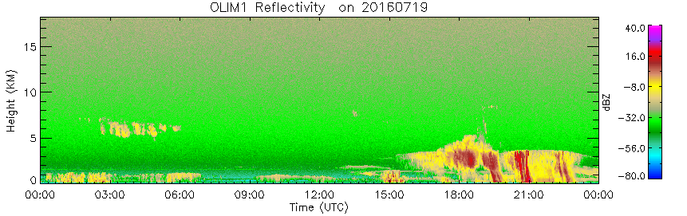

============================================
Design for Clutter Analysis for the OLI KaZR
============================================

Introduction
============
The Ka-Band Zenith Pointing Radar (KaZR) was deployed as part of an ARM Mobile
Facility three (AMF3) deployment to Oliktok Point on the North Slope of Alaska. 

   Time height plot of reflectivity. Note the clutter at 1,500 meters. 

